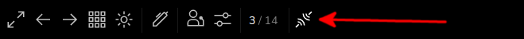
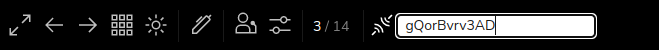
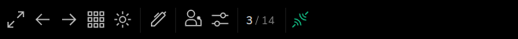

# slidev-addon-sync

[](https://www.npmjs.com/package/slidev-addon-sync)

Sync component for [Slidev](https://sli.dev/).

This is compatible with the [slidev-sync-server](https://github.com/Smile-SA/slidev-sync-server) for the SSE or WebSocket server

See below for more examples.

## Installation

```bash
npm i slidev-addon-sync
```

## Slidev Configuration

Define this package into your slidev addons.

In your slides metadata (using Front Matter):

```
---
addons:
  - slidev-addon-sync
---
```

Or in your `package.json`:

```json
{
  "slidev": {
    "addons": ["slidev-addon-sync"]
  }
}
```

## Server configuration

### Define the Websocket or SSE server

You can use a Server Sent Events server or a WebSocket server to allow communication with multiple clients.

You can use [slidev-sync-server](https://github.com/Smile-SA/slidev-sync-server) or create your own implementation.

In that case you need to use the `syncSettings` config in your markdown file Front Matter to set the server URL (Update the value of `server` using your own URL).

For HTTP Server Sent Events server:

```yaml
---
syncSettings:
  server: http://localhost:8080
---
```

Or for WebSocket server:

```yaml
---
syncSettings:
  server: ws://localhost:8080
---
```

Then, in the presentation, click on the connect icon.



Type in a hash that you can share with other peoples and press <key>enter</key>. (you can use the proposed hash: everybody that are on the same presentation will have the same)



You are connected!



### Auto-connect

You can also use the `autoConnect` settings to automatically connect to the server:

```yaml
---
syncSettings:
  autoConnect: true
---
```

Or provide a number of seconds. In that case you will need to connect the first time, and then if you refresh the page it will automatically reconnect you if the number of seconds since the last connection has not been elapsed:

```yaml
---
syncSettings:
  autoConnect: 86400 # one day
---
```

### Enabling

By default this addon will only be visible and enabled in your static build.

There should be no need to use in dev, because in that case the synchronization in handled by the dev server.

If you still need to activate this addon in dev mode you can use:

```yaml
---
syncSettings:
  enabled: true # It will be enabled for both dev and build modes
---
```

You can also pass `"dev"` to only enable it in dev mode or `false` to disable it entirely.

## State configuration

### State channels

By default this addon will synchronize all channels.

Channels are internal slidev states created with `createSyncState` and by default there are two channels:

* `shared`: state for navigation (pages and clicks) and cursor
* `drawings`: drawing state

If you want to synchronize only some channel then use:

```yaml
---
syncStates:
  - drawings # This will only synchronize drawings
# Or alternatively:
syncStates: ["drawings"]
---
```

### State keys

In addition to selecting state channels you can also filter the keys of that channel to synchronize.

By default this addon will filter on the following keys:

* `shared`:
  * `"page"`: the current navigation page
  * `"clicks"`: the current navigation click
  * `"cursor"`: the cursor position
  * `"lastUpdate"`: used internally to synchronize page, clicks or cursor if the update comes from the presenter view
* `drawings`: no filter

For example if you don't want to synchronize the cursor you can set:

```yaml
---
syncStates:
  shared: ["page", "clicks", "lastUpdate"]
  drawings: true # true means "no filter"
---
```

**Note:** don't forget in that case to list all channels you want to synchronize

You can also use the alternative object syntax:

```yaml
---
syncStates:
  shared:
    keys: ["page", "clicks", "lastUpdate"]
  drawings:
    keys: true
---
```

### Presenter

By default this addon will only send state updates to the server if you are in presenter view.

This is probably want you want if you only want to synchronize slidev states.

But other addons like [`slidev-component-poll`](https://github.com/Smile-SA/slidev-component-poll) also rely on `createSyncState` to synchronize states, but in this example you want everybody to be able to use the poll, so in other words, to send state updates.

In that case you case the `presenter` settings to specify the channels for which you want everyone to be able to send updates:

```yaml
---
syncStates:
  poll:
    presenter: false
---
```

### State initialization

When you connect, this addon will, by default send the current state to the server.

This is probably what you want when your are presenting to other peoples, it will in that case send the drawings you have already made the current navigation...etc.

If you don't want this behavior, you can use the `init` settings:

```yaml
---
syncStates:
  poll:
    init: false
---
```
